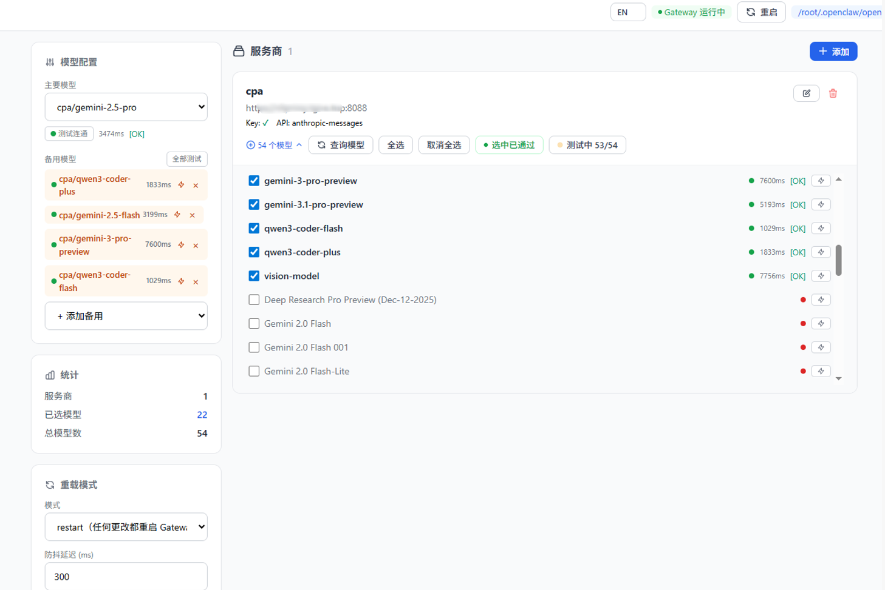
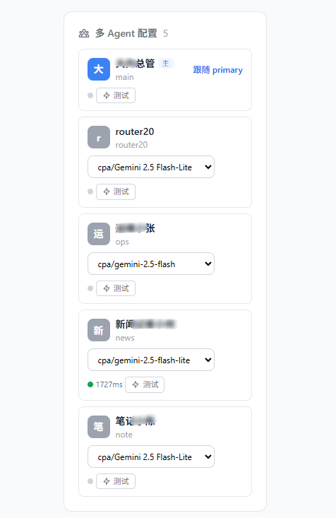
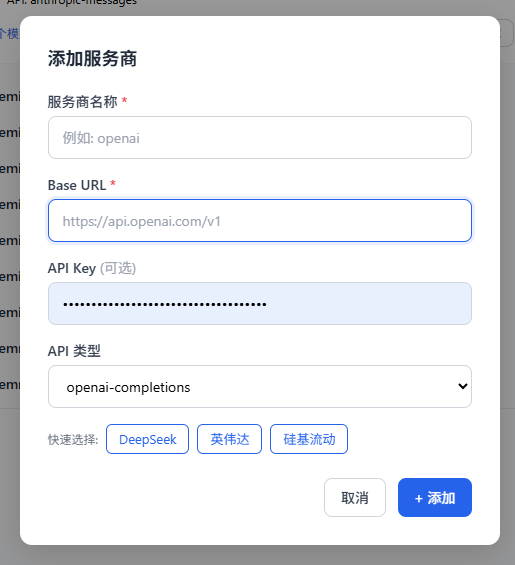
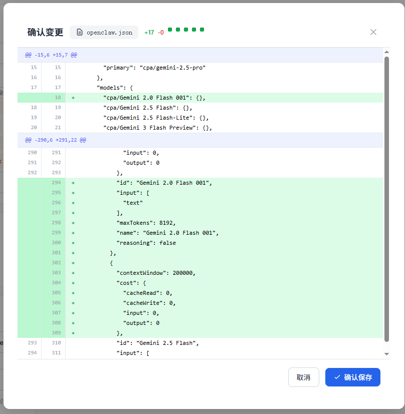

# openclaw-model-switcher

> **Language / 语言:** [English](README.md) | [中文](README.zh-CN.md)

Web-based model switching & management dashboard for [OpenClaw](https://github.com/anthropics/openclaw) Gateway.

Manage multiple LLM providers, select primary/fallback models, test connectivity, preview config diffs, and hot-apply changes to `openclaw.json` — all from a single page.


## Screenshots

| Overview | Providers & models |
|:--------:|:------------------:|
|  |  |

| Configuration & routing | Gateway & tools |
|:-----------------------:|:---------------:|
|  |  |

## Features

- **Provider Management** — Add, edit, delete LLM providers (OpenAI-compatible / Anthropic). Built-in presets for DeepSeek, NVIDIA, SiliconFlow.
- **Model Discovery** — Fetch available models from provider API (`/v1/models`) with one click.
- **Model Selection** — Toggle individual models, batch select/deselect, or auto-select only tested-OK models.
- **Connectivity Testing** — Test single model or batch-test all models under a provider (concurrent, real-time progress).
- **Primary & Fallback** — Configure primary model and ordered fallback chain.
- **Multi-Agent Support** — Assign different models to different agents, or let them follow primary.
- **Config Diff Preview** — Before applying, preview a line-by-line diff (Myers algorithm) of the changes to `openclaw.json`.
- **Auto Backup** — Each apply creates a timestamped backup (`openclaw.json.bak.YYYYMMDDHHMMSS`).
- **Hot Reload Control** — Configure gateway reload behavior: `hybrid`, `hot`, `restart`, or `off`, with debounce delay.
- **Gateway Management** — Monitor gateway status and restart from the dashboard.
- **Unsaved Change Indicator** — Apply button turns amber with pulse animation when pending changes exist.
- **i18n** — Chinese / English toggle, persisted in localStorage.

## Quick Start

### Prerequisites

- Go 1.25+

### Build & Run

```bash
# Clone
git clone https://github.com/yonggithub/openclaw-model-switcher.git
cd openclaw-model-switcher

# Build
go build -o openclaw-model-switcher .

# Run
./openclaw-model-switcher
```

The dashboard will be available at **http://localhost:8356**.

### Build Scripts

```bash
# Linux (amd64)
./script/build-linux.sh

# Windows (amd64)
./script/build-windows.sh

```

### Docker Deployment

#### Prerequisites

- Docker & Docker Compose
- Pre-built Linux binary at `build/OpenClawSwitch-linux` (run `./script/build-linux.sh` first)

#### Quick Start with Docker Compose

```bash
# 1. Build the Linux binary
./script/build-linux.sh

# 2. Start the container
docker compose up -d
```

The dashboard will be available at **http://localhost:8356**.

#### Volumes

| Container Path | Host Path | Description |
|---------------|-----------|-------------|
| `/data` | `./data` | SQLite database (`openclawswitch.db`) and persistent data |
| `/root/.openclaw` | `/root/.openclaw` | OpenClaw Gateway config directory |

After starting the container, go to the dashboard and set the config path to `/root/.openclaw/openclaw.json` so that the application can read and write the host's OpenClaw configuration file.

#### Host Process Monitoring

The container uses `pid: "host"` and `privileged: true` so the app can monitor host processes, run `nsenter` to start the Gateway on the host filesystem, and use signals for restart. This powers **Gateway Status** and **Restart Gateway** in the dashboard.

> **Security Note**: `pid: host` + `privileged` grants strong host access. Use only in trusted environments.

#### Docker Commands

```bash
# Start
docker compose up -d

# View logs
docker compose logs -f

# Stop
docker compose down

# Rebuild after binary update
docker compose up -d --build
```

## Usage

1. **Add a provider** — Click "Add", fill in name / base URL / API key, or use a preset.
2. **Fetch models** — Expand a provider card and click "Fetch Models" to pull available models.
3. **Select models** — Check the models you want to use. Use "Batch Test" to verify connectivity, then "Select Passed" to keep only working ones.
4. **Configure routing** — In the sidebar, pick a primary model and optionally add fallbacks.
5. **Apply config** — Click "Apply Config", review the diff, and confirm. The config is written to `openclaw.json` with an automatic backup.

### Management

```bash
./script/start.sh    # Start in background (PID → app.pid)
./script/stop.sh     # Stop by PID
./script/status.sh   # Check running status
```

## Architecture

```
┌─────────────────────────────────────┐
│           Browser (SPA)             │
│   Vue 3 + Tailwind CSS (CDN)       │
└──────────────┬──────────────────────┘
               │ HTTP/JSON
┌──────────────▼──────────────────────┐
│         Go HTTP Server (:8356)      │
│  ┌──────────┐  ┌──────────────────┐ │
│  │ Handlers  │  │ Config Engine    │ │
│  │ (REST API)│  │ (R/W openclaw    │ │
│  │           │  │  .json + diff)   │ │
│  └─────┬─────┘  └────────┬────────┘ │
│        │                 │          │
│  ┌─────▼─────────────────▼────────┐ │
│  │     SQLite (providers,         │ │
│  │     models, settings)          │ │
│  └────────────────────────────────┘ │
└─────────────────────────────────────┘
```

## API Endpoints

| Method | Path | Description |
|--------|------|-------------|
| `GET` | `/` | Serve dashboard SPA |
| `GET` | `/api/providers` | List providers |
| `POST` | `/api/providers` | Create provider |
| `PUT` | `/api/providers/{id}` | Update provider |
| `DELETE` | `/api/providers/{id}` | Delete provider & its models |
| `POST` | `/api/providers/{id}/fetch` | Fetch models from provider API |
| `GET` | `/api/models` | List all models |
| `PUT` | `/api/models/{id}/toggle` | Toggle model selection |
| `POST` | `/api/models/batch-select` | Batch select/deselect models |
| `POST` | `/api/models/test` | Test single model connectivity |
| `GET` | `/api/agents` | List agents from config |
| `GET` | `/api/config` | Read current openclaw.json |
| `GET` | `/api/config/path` | Get config file path & status |
| `POST` | `/api/config/path` | Set config file path |
| `POST` | `/api/config/preview` | Preview config changes (diff) |
| `POST` | `/api/config/apply` | Apply config to file |
| `GET` | `/api/config/reload` | Get reload settings |
| `GET` | `/api/gateway/status` | Gateway process status |
| `POST` | `/api/gateway/restart` | Restart gateway process |

## Tech Stack

| Layer | Technology |
|-------|-----------|
| Backend | Go (stdlib `net/http`) |
| Frontend | Vue 3.4 (CDN) + Tailwind CSS 2.x |
| Database | SQLite via [modernc.org/sqlite](https://pkg.go.dev/modernc.org/sqlite) (pure Go, no CGO) |
| Embedding | `//go:embed` for single-binary distribution |

## Project Structure

```
.
├── main.go              # Entry point, route registration
├── handlers.go          # HTTP request handlers
├── config.go            # Config file read/write/diff logic
├── provider.go          # Provider API interaction & model testing
├── db.go                # SQLite initialization & schema
├── go.mod / go.sum      # Go module dependencies
├── README.md            # English readme (default on GitHub)
├── README.zh-CN.md      # Chinese readme
├── Dockerfile           # Docker image definition (Alpine-based)
├── docker-compose.yml   # Docker Compose orchestration
├── img/                 # README screenshots
├── templates/
│   └── index.html       # Single-page frontend (embedded at build)
└── script/
    ├── build-linux.sh   # Linux build script
    ├── start.sh         # Background start
    ├── stop.sh          # Stop by PID
    └── status.sh        # Status check
```

## Configuration

The dashboard manages `openclaw.json` for OpenClaw Gateway. Key sections:

```jsonc
{
  "models": {
    "providers": { /* provider configs with baseUrl, apiKey, models */ }
  },
  "agents": {
    "defaults": {
      "model": {
        "primary": "provider/model-id",
        "fallbacks": ["provider/model-id-2"]
      }
    },
    "list": [ /* agent definitions */ ]
  },
  "gateway": {
    "reload": { "mode": "hybrid", "debounceMs": 300 }
  }
}
```

## License

This project is licensed under the [MIT License](LICENSE).

## Contributing

Contributions are welcome! Please open an issue or submit a pull request.

1. Fork the repository
2. Create your feature branch (`git checkout -b feature/amazing-feature`)
3. Commit your changes (`git commit -m 'Add amazing feature'`)
4. Push to the branch (`git push origin feature/amazing-feature`)
5. Open a Pull Request
